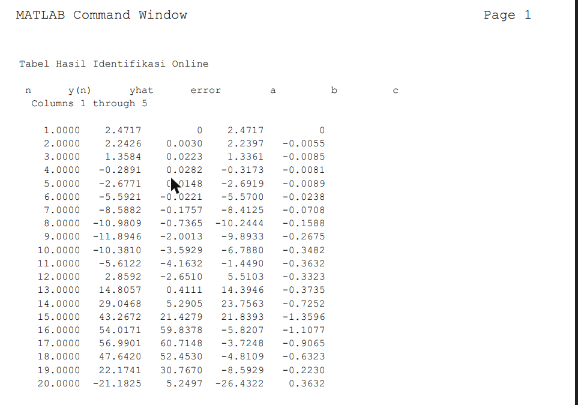

# Recursive Online System Identification

A gradient-descent parameter estimator written from first principles in MATLAB —
no System Identification Toolbox — that identifies a discrete-time ARX model of a
nonlinear plant while the plant is running.

## The problem

Offline identification needs the whole data record before it can fit anything.
That is useless for a controller that has to adapt while a plant is operating.
This estimator updates its parameters on every new sample instead.

The plant under test is deliberately nonlinear:

```
y(x) = e^x · sin(2x),    x = 1 : 0.2 : 5
```

## Model structure

A first-order ARX model with one lagged input:

```
ŷ(n) = −a·y(n−1) + b·x(n) + c·x(n−1)
```

which is estimated as the inner product of a regression vector and a parameter
vector:

```
φ(n) = [ −y(n−1) ,  x(n) ,  x(n−1) ]ᵀ
θ    = [ a , b , c ]ᵀ
ŷ(n) = φ(n)ᵀ · θ
```

## Update law

Least-mean-squares gradient descent on the one-step prediction error:

```
e(n) = y(n) − ŷ(n)
θ(n) = θ(n−1) + μ · e(n) · φ(n)
```

with learning rate `μ = 0.001`. The gain sets the usual trade-off: raise it and
the estimate tracks faster but rings; lower it and the estimate is smooth but
lags the plant.

`θ` is initialised at zero, so the first prediction is necessarily wrong and the
regression vector is seeded with the first sample only.

## Running it

Open `online_identification.m` in MATLAB and run. It prints a per-iteration table
of `n`, the measured `y(n)`, the predicted `ŷ(n)`, the error, and the three
parameters as they converge, followed by the final parameter values.

Reading that table is the point of the exercise — you can watch the error shrink
and the parameters settle, and see how far 20 samples actually gets you.


## Result



Each row is one sample: the measured `y(n)`, the prediction `yhat`, the error
between them, and the parameters as they stand at that iteration. The estimator
starts from zero, so the first prediction is necessarily wrong and the early
error is large. Watching the error column shrink while the parameters settle is
the whole point of running it this way rather than fitting the record offline.

## Notes

Source comments are in Indonesian, as originally written for a System Modelling
and Identification course at Universitas Diponegoro.
